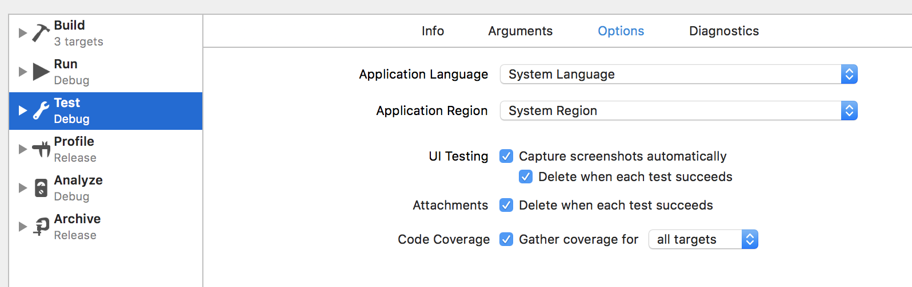

[](http://badge.fury.io/rb/slather)
[](https://travis-ci.org/SlatherOrg/slather)
[](https://coveralls.io/r/SlatherOrg/slather?branch=master)

Generate test coverage reports for Xcode projects & hook it into CI.

### Projects that use Slather

| Project | Coverage |
| ------- |:--------:|
| [Parsimmon](https://github.com/ayanonagon/Parsimmon) | [](https://coveralls.io/r/ayanonagon/Parsimmon?branch=master) |
| [VENCore](https://github.com/venmo/VENCore) | [](https://coveralls.io/r/venmo/VENCore?branch=master) |
| [DAZABTest](https://github.com/dasmer/DAZABTest) | [](https://coveralls.io/r/dasmer/DAZABTest?branch=master) |
| [TBStateMachine](https://github.com/tarbrain/TBStateMachine) | [](https://coveralls.io/r/tarbrain/TBStateMachine?branch=master) |

## Installation

Add this line to your application's Gemfile:

```ruby
gem 'slather'
```

And then execute:

```sh
$ bundle
```

Or install the gem:

```sh
gem install slather
```

## Usage

Enable test coverage by ticking the *"Gather coverage data"* checkbox when editing a scheme:



To verify you're ready to generate test coverage, run your test suite on your project, and then run:

```sh
$ slather coverage -s --scheme YourXcodeSchemeName path/to/project.xcodeproj
```

If you use a workspace in Xcode you need to specify it: 

```sh
$ slather coverage -s --scheme YourXcodeSchemeName --workspace path/to/workspace.xcworkspace path/to/project.xcodeproj
```

### Setup for Xcode 5 and 6

Run this command to enable the `Generate Test Coverage` and `Instrument Program Flow` flags for your project:

```sh
$ slather setup path/to/project.xcodeproj
```

### Usage with Codecov

Login to [Codecov](https://codecov.io/) (no need to activate a repository, this happens automatically). Right now, `slather` supports Codecov via **all** supported CI providers [listed here](https://github.com/codecov/codecov-bash#ci-providers).

Make a `.slather.yml` file:

```yml
# .slather.yml

coverage_service: cobertura_xml
xcodeproj: path/to/project.xcodeproj
scheme: YourXcodeSchemeName
source_directory: path/to/sources/to/include
output_directory: path/to/xml_report
ignore:
  - ExamplePodCode/*
  - ProjectTestsGroup/*
```

And then in your `.travis.yml`, `circle.yml` (or after test commands in other CI providers), call `slather` after a successful build:

```yml
# .travis.yml

before_install: rvm use $RVM_RUBY_VERSION
install: bundle install --without=documentation --path ../travis_bundle_dir
after_success: 
  - slather
  - bash <(curl -s https://codecov.io/bash) -f path/to/xml_report/cobertura.xml
```

```yml
# circle.yml

test:
  post:
    - bundle exec slather
    - bash <(curl -s https://codecov.io/bash)
```

> Private repo? Add `-t :uuid-repo-token` to the codecov uploader. Read more about uploading report to Codecov [here](https://github.com/codecov/codecov-bash)

### Usage with Coveralls

Login to [Coveralls](https://coveralls.io/) and enable your repository. Right now, `slather` supports Coveralls via [Travis CI](https://travis-ci.org) and [CircleCI](https://circleci.com).

Make a `.slather.yml` file:

```yml
# .slather.yml

coverage_service: coveralls
xcodeproj: path/to/project.xcodeproj
scheme: YourXcodeSchemeName
ignore:
  - ExamplePodCode/*
  - ProjectTestsGroup/*
```

And then in your `.travis.yml` or `circle.yml`, call `slather` after a successful build:

```yml
# .travis.yml

before_install: rvm use $RVM_RUBY_VERSION
install: bundle install --without=documentation --path ../travis_bundle_dir
after_success: slather
```

```yml
# circle.yml

test:
  post:
    - bundle exec slather

```

#### Usage with Travis CI Pro

To use Coveralls with Travis CI Pro (for private repos), add following lines along with other settings to `.slather.yml`:

```yml
# .slather.yml

ci_service: travis_pro
coverage_access_token: <YOUR ACCESS TOKEN>
```

The coverage token can be found at [Coveralls](https://coveralls.io/) repo page. Or it can be passed in via the `COVERAGE_ACCESS_TOKEN` environment var.

### Cobertura

To create a Cobertura XML report set `cobertura_xml` as coverage service inside your `.slather.yml`. Optionally you can define an output directory for the XML report:

```yml
# .slather.yml

coverage_service: cobertura_xml
xcodeproj: path/to/project.xcodeproj
scheme: YourXcodeSchemeName
source_directory: path/to/sources/to/include
output_directory: path/to/xml_report
ignore:
  - ExamplePodCode/*
  - ProjectTestsGroup/*
```

Or use the command line options `--cobertura-xml` or `-x` and `--output-directory`:

```sh
$ slather coverage -x --output-directory path/to/xml_report
```

### Static HTML

To create a report as static html pages, use the command line options `--html`:

```sh
$ slather coverage --html --scheme YourXcodeSchemeName path/to/project.xcodeproj
```

This will make a directory named `html` in your root directory (unless `--output-directory` is specified) and will generate all the reports as static html pages inside the directory. It will print out the report's path by default, but you can also specify `--show` flag to open it in your browser automatically.

### TeamCity Reporting

To report the coverage statistics to TeamCity:

```sh
$ slather coverage --teamcity -s --scheme YourXcodeSchemeName
```

### Coverage for code included via CocoaPods

If you're trying to compute the coverage of code that has been included via
CocoaPods, you will need to tell CocoaPods to use the Slather plugin by
adding the following to your `Podfile`.

```ruby
plugin 'slather'
```

You will also need to tell Slather where to find the source files for your Pod.

```yml
# .slather.yml

source_directory: Pods/AFNetworking
```

### Custom Build Directory

Slather will look for the test coverage files in `DerivedData` by default. If you send build output to a custom location, like [this](https://github.com/erikdoe/ocmock/blob/7f4d22b38eedf1bb9a12ab1591ac0a5d436db61a/Tools/travis.sh#L12), then you should also set the `build_directory` property in `.slather.yml`

### Building in a workspace

Include the `--workspace` argument or add `workspace` to `.slather.yml` if you build your project in a workspace. For example:

```sh
$ slather coverage --html --scheme YourXcodeSchemeName --workspace path/to/workspace.xcworkspace path/to/project.xcodeproj
```

## Contributing

We’d love to see your ideas for improving this library! The best way to contribute is by submitting a pull request. We’ll do our best to respond to your patch as soon as possible. You can also submit a [new GitHub issue](https://github.com/SlatherOrg/slather/issues/new) if you find bugs or have questions. :octocat:

Please make sure to follow our general coding style and add test coverage for new features!

## Contributors

* [@tpoulos](https://github.com/tpoulos), the perfect logo.
* [@ayanonagon](https://github.com/ayanonagon) and [@kylef](https://github.com/kylef), feedback and testing.
* [@jhersh](https://github.com/jhersh), CircleCI support.
* [@tarbrain](https://github.com/tarbrain), Cobertura support and bugfixing.
* [@ikhsan](https://github.com/ikhsan), html support.
